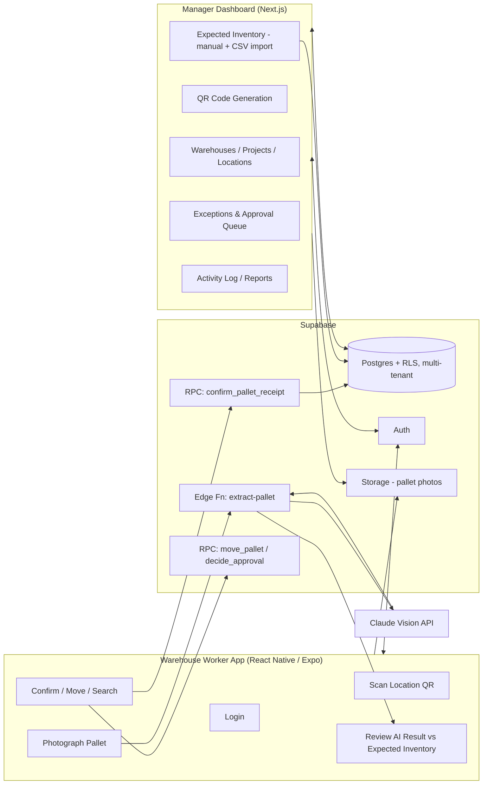

# WarehouseIQ — V1 Architecture & Delivery Plan

**Status:** Documentation complete, approved architecture, awaiting go-ahead
to begin M0. No application code has been written yet.
**Scope:** MVP suitable for customer/investor demos. Not the final
enterprise product.

This file is the index and the architecture-level summary. The full product
and technical specification lives across five companion documents — read
them in this order:

1. **PRODUCT.md** — mission, founder story, personas, business model. The
   document every other decision must trace back to.
2. **DATABASE.md** — every table, relationship, RLS rule, and why it exists.
3. **SCREENS.md** — every screen, wireframe, and interaction, mobile and web.
4. **API.md** — every RPC function and edge function, inputs/outputs/auth.
5. **ROADMAP.md** — V1 through V5 and why features land where they do.
6. **DESIGN.md** — the visual/interaction system both apps share.

---

## 1. What WarehouseIQ Actually Is

WarehouseIQ is not a WMS, and it does not replace one. A WMS/ERP (SAP,
Oracle, NetSuite, Dynamics) or a spreadsheet (Excel, Smartsheet) tells you
what *should* be in the warehouse. WarehouseIQ is the independent
verification layer that confirms *reality matches that record* — it sits
alongside whatever system a customer already runs, not in place of it. See
PRODUCT.md §4 for the full positioning.

Every feature decision is filtered through that lens: the product's
credibility depends entirely on (a) having a real "expected" record to
verify against, and (b) an audit trail that is complete, tamper-evident, and
never lossy. Those two constraints drive more of the architecture than the
AI does.

---

## 2. System Overview

Two architectural decisions carry the most weight:

1. **The mobile app never talks to the AI vision provider directly** — the
   photo goes to a Supabase Edge Function, which calls Claude and returns
   structured data to the app for human review. API keys stay server-side.
2. **Every receiving decision is matched against an Expected Inventory
   Record**, not just validated against the AI's own output. Without this,
   "verify physical vs. digital" has nothing external to check against —
   see DATABASE.md §3 and API.md §`rpc/confirm_pallet_receipt`.

---

## 3. Tech Stack & Rationale

| Layer | Choice | Why |
|---|---|---|
| Worker mobile app | **React Native + Expo, TypeScript** | Camera + QR scanning + OTA updates + TestFlight/internal APK distribution working in days, not weeks. |
| Manager dashboard | **Next.js + TypeScript** | Deploys to Vercel with zero DevOps; shares the TypeScript type layer with the mobile app. |
| UI kit | **Tailwind CSS + shadcn/ui** | "Modern, clean, minimal, enterprise" without fighting a themed component library. |
| Backend | **Supabase (Postgres, Auth, Storage, Edge Functions, RLS)** | Real relational integrity for the org → warehouse → location → pallet → movement chain; RLS enforces multi-tenant isolation and "workers insert, nobody deletes" *at the database layer*. |
| AI extraction | **Claude Vision, server-side via Edge Function** | Structured JSON extraction with per-field confidence — a vision-LLM task, not classical OCR, which can't reliably produce multi-field structured output across varied label layouts. |
| QR codes | **Server-generated (`qrcode` lib), printable sheet in the dashboard** | Each location gets a QR encoding a stable UUID; no third-party QR service or per-code cost. |
| Hosting | **Vercel (dashboard), Supabase Cloud (backend), Expo EAS (mobile builds)** | Zero servers to manage, gets us to a shippable demo without a DevOps hire. |

**Explicitly not doing for V1:** custom OCR model training, offline-first
mobile sync, native iOS/Android (Swift/Kotlin) apps, real ERP/WMS
integrations (SAP/Oracle/NetSuite/Dynamics), Kubernetes/self-hosted infra.
All legitimate V2+ conversations (see ROADMAP.md) — building them now would
be over-engineering an MVP.

---

## 4. Data Model — Summary

Full detail, every column, every RLS rule: **DATABASE.md**. Entity groups:

- **Tenancy:** `organizations`, `profiles` (role: worker | manager) — every
  tenant table carries `org_id`; RLS enforces org isolation on every table.
- **Warehouse structure:** `warehouses`, `projects`, `locations`.
- **Expected Inventory (the digital record):** `expected_inventory_records`,
  `expected_serial_numbers`, `csv_imports`, `csv_import_rows` — populated by
  manual entry or CSV today, and by a future ERP sync (V2) into the exact
  same table, never a parallel system.
- **Pallets:** `pallets`, `serial_numbers` (own child table, not an array
  column — scales to thousands of serials per pallet), `pallet_photos`.
- **The trust ledger:** `pallet_movements` and `activity_log` (append-only,
  `INSERT`-only grants — no `UPDATE`/`DELETE` for any role, including
  managers), `pallet_exceptions`, `approval_requests`.

---

## 5. Safety Features — how each one actually gets implemented

Full detail with exact exception types: DATABASE.md §5, API.md
`rpc/confirm_pallet_receipt`. Summary:

| Requirement | Mechanism |
|---|---|
| Duplicate pallet ID | Unique check on `(org_id, pallet_label_id)` among active pallets before insert. |
| Duplicate / missing serials | `serial_numbers` unique constraint per org; expected-serial matching against `expected_serial_numbers`. |
| Wrong project / manufacturer / product / unknown PO / over-receipt | Cross-checked against the matched `expected_inventory_records` row inside `rpc/confirm_pallet_receipt`. |
| Quantity mismatch | Compared against `expected_quantity`/remaining balance on the expected record. |
| Low AI confidence | Per-field confidence from Claude; below threshold, field is forced open for manual correction before Confirm is enabled. |
| Serious exceptions (unknown PO, duplicate pallet/serial, over-receipt) | Blocks auto-acceptance — creates an `approval_requests` row; a manager must approve or reject before the pallet counts as received. |
| Movement confirmation | Every move/receive writes one immutable ledger row: employee, timestamp, photo, previous/new location. |

---

## 6. Milestones

Summary only — full V1–V5 rationale in **ROADMAP.md**. We build **one
milestone at a time** and stop for review after each.

- **M0** — Supabase schema (multi-tenant), RLS, auth roles, repo
  scaffolding. No UI yet. *Acceptance: a manager and worker in two
  different orgs can both log in, and neither can see the other's data.*
- **M1** — Manager Dashboard setup tools: Warehouses, Projects, Locations,
  QR generation, Expected Inventory (manual entry + CSV import).
- **M2** — Worker App core loop: scan → photograph → AI extraction →
  review against Expected Inventory → confirm (including the
  approval-required path for blocking exceptions).
- **M3** — Move, search, pallet detail, immutable timeline.
- **M4** — Exceptions & Approval Queue, Activity Log, Warehouse Dashboard,
  Reports.
- **M5** — Demo polish: empty states, error handling, seed data, deployment
  hardening.

---

## 7. Decisions Locked In (superseding the original open questions)

1. **Multi-tenant from day one.** Every record belongs to an organization;
   RLS enforces isolation on every table.
2. **Serial numbers are a child table**, not an array column.
3. **WarehouseIQ does not replace the customer's WMS/ERP in V1.** Expected
   Inventory Records are the interim digital record, explicitly designed so
   V2 ERP integrations populate the same table without a schema change.
4. **One user belongs to exactly one organization in V1** — flagged as a
   real assumption to revisit if a customer needs cross-org contractor
   access (see DATABASE.md §7).

---

## 8. Next Step

Documentation is complete. Waiting on your go-ahead (see the accompanying
chat message for the CTO-level review: weak assumptions, features to
consider cutting from V1, and edge cases worth deciding on before M0).
Once approved, we build **M0 only** and stop for review before touching M1.
