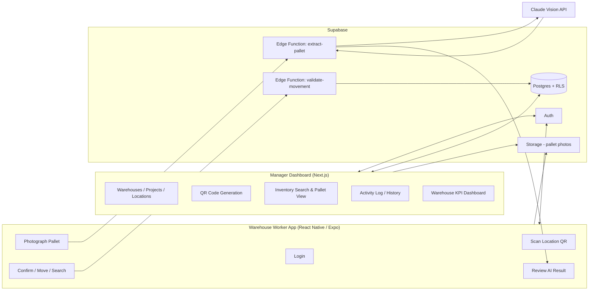

# WarehouseIQ — V1 Architecture & Delivery Plan

**Status:** Draft for approval — no application code has been written yet.
**Author:** Acting CTO (Claude)
**Scope:** MVP suitable for customer/investor demos. Not the final enterprise product.

---

## 1. What WarehouseIQ Actually Is

WarehouseIQ is not a WMS. A WMS tells you what *should* be in the warehouse.
WarehouseIQ tells you whether *reality matches the record* — it's a verification
and trust layer that sits on top of (or alongside) however inventory is
currently tracked. Every feature decision below is filtered through that lens:
the product's credibility depends entirely on the audit trail being complete,
tamper-evident, and never lossy. That constraint drives more of the
architecture than the AI does.

---

## 2. System Overview

Two clients, one backend, one AI extraction step in the middle.

Key architectural decision: **the mobile app never talks to the AI vision
provider directly.** The photo goes to a Supabase Edge Function, which calls
Claude, validates the result against business rules (duplicate IDs, project
mismatch, confidence threshold), and only then returns it to the app for
human confirmation. This keeps API keys server-side and gives us one place to
enforce the safety rules regardless of client.

---

## 3. Tech Stack & Rationale

| Layer | Choice | Why |
|---|---|---|
| Worker mobile app | **React Native + Expo, TypeScript** | Matches your instinct. Expo gets camera + QR scanning + OTA updates + TestFlight/internal APK distribution working in days, not weeks — important when the deliverable is a demo, not an app-store launch. |
| Manager dashboard | **Next.js + TypeScript** | Server-rendered, deploys to Vercel with zero DevOps, and shares the TypeScript type layer with the mobile app (one language across the whole stack — small team, no context-switching tax). |
| UI kit | **Tailwind CSS + shadcn/ui** | Gets "modern, clean, minimal, enterprise" for free. It's unstyled-by-default primitives, not a themed component library fighting you, so it won't look like a generic template in front of investors. |
| Backend | **Supabase (Postgres, Auth, Storage, Edge Functions, RLS)** | Matches your instinct, and it's the right call for this specific product: Postgres gives us real relational integrity for warehouses → locations → pallets → movements; Row-Level Security lets us enforce "workers can insert, nobody can delete" *at the database layer*, not just in app code, which matters a lot for an audit-trail product being pitched on trustworthiness. Auto-generated APIs remove backend boilerplate we don't need to hand-write for an MVP. |
| AI extraction | **Claude Vision (Sonnet), server-side via Edge Function** | The product's core value is *structured, confident extraction* from a messy pallet label photo — Pallet ID, PO, Manufacturer, Quantity, Product, Serial Numbers — as JSON, with a confidence signal per field. That's a vision-LLM task, not classical OCR: Tesseract-style OCR gives you raw text, not structured fields, and falls over on varied label layouts, handwriting, and multi-line serial lists. We ask Claude for strict JSON against a schema and a confidence score; traditional OCR becomes unnecessary. OpenAI Vision is a viable swap-in if we ever need a second model for comparison, but no reason to integrate both for V1. |
| QR codes | **Server-generated (`qrcode` lib) in an Edge Function, printable sheet in the dashboard** | Each location gets a QR encoding a stable location UUID. No third-party QR service needed, no per-code cost. |
| Hosting | **Vercel (dashboard), Supabase Cloud (backend), Expo EAS (mobile builds)** | All three have generous free/low tiers, zero servers to manage, and get us to "shippable demo" without a DevOps hire. |

**Explicitly not doing for V1:** custom OCR model training, offline-first
mobile sync, multi-tenant billing, native iOS/Android (Swift/Kotlin) apps,
Kubernetes/self-hosted infra. All of these are legitimate *v2+* conversations
once the concept is validated with real customers — building them now would
be over-engineering an MVP.

---

## 4. Data Model (core entities)

Deliberately relational and boring — this is not a place to get clever.

- `organizations` *(optional in V1 if we're single-tenant for the pilot customer; flagged as a decision point below)*
- `users` — role: `worker` | `manager` (Supabase Auth + a `profiles` table for role)
- `warehouses`
- `projects`
- `locations` — belongs to a warehouse; has a unique QR-encoded id
- `pallets` — Pallet ID, Project, PO, Manufacturer, Quantity, Product, Serial Numbers (array), AI confidence per field, current `location_id`, current `status`
- `pallet_photos` — every photo ever taken of a pallet, linked to a movement
- `pallet_movements` — **append-only ledger**: pallet_id, employee_id, timestamp, previous_location_id, new_location_id, photo_id, AI-extraction snapshot at time of move
- `activity_log` — every create/confirm/move/flag event, for the manager-facing audit view

**Immutability rule, enforced structurally, not by convention:** `pallet_movements`
and `activity_log` grant `INSERT` only at the Postgres role level — no `UPDATE`,
no `DELETE`, even for admins, even from the Supabase dashboard. "Nothing can
ever be deleted" needs to be true even if someone makes a mistake in the app
code later, so it belongs in the database's permission grants, not just in
application logic.

---

## 5. Safety Features — how each one actually gets implemented

| Requirement | Mechanism |
|---|---|
| Duplicate pallet ID | Unique constraint on `pallets.pallet_id` scoped to org/warehouse; Edge Function checks before insert and surfaces a blocking warning, not a silent failure. |
| Wrong project assignment | Cross-check AI-extracted project against the project assigned to the target location; mismatch = warning requiring explicit manager-visible override, logged as a flagged event. |
| Quantity mismatch | Compare AI-extracted quantity against expected PO quantity (if known); flag variance beyond a threshold. |
| Low AI confidence | Claude returns a per-field confidence score; below threshold, that field is highlighted for mandatory manual correction before Confirm is enabled. |
| Movement confirmation | Confirm button is disabled until all flags are acknowledged; every confirm writes one immutable `pallet_movements` row with employee, timestamp, photo, previous/new location. |

---

## 6. Milestones

Each milestone ships something demoable end-to-end. We build **one at a
time**, in order, and I'll show you working software before moving to the
next.

**M0 — Foundations (no visible UI yet)**
Supabase project, schema + RLS policies, auth with worker/manager roles, repo
scaffolding for both apps, CI lint/typecheck. Acceptance: a manager and a
worker account can log in against a real database with role-based access
already enforced.

**M1 — Manager Dashboard: setup tools**
Create Warehouses, Projects, Locations. Generate & print/export QR codes.
Acceptance: a manager can fully configure a warehouse and print scannable
location labels.

**M2 — Worker App: capture & confirm (the core AI loop)**
Login, scan a location QR, photograph a pallet, AI extraction via the Edge
Function, review/edit screen with confidence highlighting, Confirm → pallet
created and assigned to that location. Acceptance: a worker can onboard a
real pallet end-to-end and it shows up correctly in the database.

**M3 — Movement & search**
Move inventory (scan new location, confirm, ledger entry written), search
inventory (worker + manager), pallet detail view showing full history.
Acceptance: a pallet can be moved and its complete location history is
visible and correct.

**M4 — Manager visibility & safety features**
Activity Log, Inventory History, Warehouse Dashboard (KPIs/overview),
duplicate/mismatch/low-confidence detection surfaced in both apps.
Acceptance: the safety checks in section 5 all demonstrably fire, and a
manager can see everything that happened, by whom, and when.

**M5 — Demo polish**
Empty states, error handling, seeded demo data, deployment hardening for
showing to customers/investors.

---

## 7. Open Decisions Before We Start Building

1. **Single-tenant vs. multi-org from day one?** If this MVP is for one pilot
   customer, we skip the `organizations` table and multi-tenant RLS
   complexity entirely and add it later. If you already know you'll be
   demoing to multiple prospective customers who each need isolated data,
   we should build the org boundary into the schema now — it's cheap now
   and expensive to retrofit. **Which is it?**
2. **Serial number volume** — are we talking a handful of serials per pallet
   (fits fine in a JSON/array column) or potentially hundreds (would want a
   child table instead)? Affects the `pallets` schema in M0.
3. Any existing inventory system this needs to reconcile against in V1, or
   is WarehouseIQ the sole system of record for this MVP?

---

## 8. Next Step

Waiting for your go-ahead on this plan (and answers to the three questions
above, if you have a strong preference — otherwise I'll make the
single-tenant / array-column / no-external-reconciliation assumption and we
can revisit later). Once approved, we build **M0 only**, and I'll stop there
for review before touching M1.
