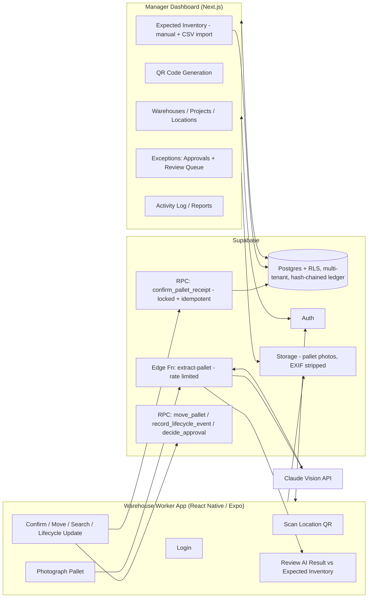

# WarehouseIQ — V1 Architecture & Delivery Plan

**Status:** Documentation complete through the final pre-M0 architecture
review. M0 (schema/RLS/auth foundations) is in progress. No product UI has
been built yet.
**Scope:** MVP suitable for customer/investor demos. Not the final
enterprise product.

This file is the architecture-level summary. For the full blueprint in one
place, read `MASTER_PRODUCT_SPEC.md` at the repo root. For the underlying
detail, the companion documents live under `/docs`:

- `/docs/product/PRODUCT.md` — mission, founder story, personas, business
  model. The document every other decision must trace back to.
- `/docs/product/SCREENS.md` — every screen, wireframe, and interaction.
- `/docs/database/DATABASE.md` — every table, relationship, RLS rule, and
  why it exists.
- `/docs/api/API.md` — every RPC function and edge function.
- `/docs/design/DESIGN.md` — the shared visual/interaction system.
- `/docs/roadmap/ROADMAP.md` — V1 through V5.
- `/docs/investor/INVESTOR.md` — pitch material.

---

## 1. What WarehouseIQ Actually Is

WarehouseIQ is not a WMS, and it does not replace one. A WMS/ERP (SAP,
Oracle, NetSuite, Dynamics) or a spreadsheet (Excel, Smartsheet) tells you
what *should* be in the warehouse. WarehouseIQ is the independent
verification layer that confirms *reality matches that record* — it sits
alongside whatever system a customer already runs, not in place of it.

Every feature decision is filtered through that lens: the product's
credibility depends entirely on (a) having a real "expected" record to
verify against, (b) an audit trail that is complete, tamper-evident, and
never lossy, and, as of the final architecture review, (c) correctly
accounting for inventory's *entire* lifecycle — not just while it sits in
the warehouse, but the moment it ships, gets installed, is consumed, or is
scrapped.

---

## 2. System Overview

Three architectural decisions carry the most weight:

1. **The mobile app never talks to the AI vision provider directly** — the
   photo goes to a rate-limited Supabase Edge Function, which calls Claude
   and returns structured data (never a guessed "project") to the app for
   human review. API keys stay server-side.
2. **Every receiving decision is matched against an Expected Inventory
   Record**, under a row lock to prevent concurrent-receipt races, with an
   idempotency key so a flaky connection can't double-insert a pallet.
   Items with no real PO match aren't blocked — they're logged as
   untracked for asynchronous manager review.
3. **Every ledger write is hash-chained**, not just insert-only. Revoking
   `UPDATE`/`DELETE` grants stops ordinary mistakes; the hash chain makes
   *any* retroactive tampering mathematically detectable, including by an
   actor with elevated database access.

---

## 3. Tech Stack & Rationale

| Layer | Choice | Why |
|---|---|---|
| Worker mobile app | **React Native + Expo, TypeScript** | Camera + QR scanning + OTA updates + TestFlight/internal APK distribution working in days, not weeks. |
| Manager dashboard | **Next.js + TypeScript** | Deploys to Vercel with zero DevOps; shares the TypeScript type layer with the mobile app. |
| UI kit | **Tailwind CSS + shadcn/ui** | "Modern, clean, minimal, enterprise" without fighting a themed component library. |
| Backend | **Supabase (Postgres, Auth, Storage, Edge Functions, RLS)** | Real relational integrity for the org → warehouse → location → pallet → movement chain; RLS enforces multi-tenant isolation and "workers insert, nobody deletes" *at the database layer*. |
| AI extraction | **Claude Vision, server-side via Edge Function** | Structured JSON extraction with per-field confidence — a vision-LLM task, not classical OCR, which can't reliably produce multi-field structured output across varied label layouts. |
| QR codes | **Server-generated (`qrcode` lib), printable sheet in the dashboard** | Each location gets a QR encoding a stable UUID; no third-party QR service or per-code cost. |
| Hosting | **Vercel (dashboard), Supabase Cloud (backend), Expo EAS (mobile builds)** | Zero servers to manage, gets us to a shippable demo without a DevOps hire. |

**Explicitly not doing for V1:** custom OCR model training, full
offline-first mobile sync (a transient session-local retry buffer is in
scope — see PRODUCT.md), native iOS/Android (Swift/Kotlin) apps, real
ERP/WMS integrations, an org-switcher UI, cryptographic external anchoring
of the audit ledger, Kubernetes/self-hosted infra. All legitimate V2+/V4
conversations (see ROADMAP.md) — building them now would be
over-engineering an MVP.

---

## 4. Data Model — Summary

Full detail, every column, every RLS rule: `/docs/database/DATABASE.md`.

- **Tenancy:** `organizations`, `profiles`, `memberships` (user↔org join
  table, added in the final review so a person can belong to more than one
  org without a future migration — V1's UI still behaves as one-org-per-
  session). RLS enforces org isolation on every table.
- **Warehouse structure:** `warehouses`, `projects`, `locations`.
- **Expected Inventory (the digital record):** `expected_inventory_records`
  (uniquely keyed on `org_id, po_number, line_number` — widened in the
  final review to support multi-line-item POs and future ERP integration),
  `expected_serial_numbers`, `csv_imports`, `csv_import_rows`.
- **Pallets:** `pallets` (with independent `receipt_status`,
  `lifecycle_status`, and `match_status` — split apart in the final review
  so approval state, physical state, and match state are each
  independently queryable), `serial_numbers` (own child table),
  `pallet_photos` (EXIF-stripped on ingest).
- **The trust ledger:** `pallet_movements`, `pallet_lifecycle_events` (new
  — Shipped/Installed/Consumed/Scrapped), and `activity_log` — all
  append-only, `INSERT`-only, hash-chained, and carrying idempotency keys.
  Plus `pallet_exceptions` (explicit `blocking` vs. `warning` severity) and
  `approval_requests` (created only for `blocking` exceptions).

---

## 5. Safety Features — how each one actually gets implemented

Full detail: `/docs/database/DATABASE.md` §5, `/docs/api/API.md`
`rpc/confirm_pallet_receipt`. Summary:

| Requirement | Mechanism |
|---|---|
| Duplicate pallet ID / serial | Unique constraints checked before insert. |
| Wrong manufacturer / product / quantity mismatch / missing serials | Cross-checked against the matched, row-locked `expected_inventory_records` row. |
| Unknown PO, duplicate pallet/serial, over-receipt | `blocking` — gates the pallet via `approval_requests` until a manager decides. |
| No matching PO at all (legitimate untracked item) | `warning` via "Log as Untracked" — never blocks the worker, reviewed asynchronously, deliberately kept out of the blocking queue to avoid approval fatigue. |
| Low AI confidence | Per-field confidence from Claude; below threshold, forced open for manual correction. Shown to workers as a plain prompt, not a raw score. |
| Movement / lifecycle confirmation | Every action writes one immutable, hash-chained ledger row: employee, timestamp, photo, previous/new location or lifecycle state, idempotency key. |

---

## 6. Milestones

Summary only — full V1–V5 rationale in `/docs/roadmap/ROADMAP.md`. We
build **one milestone at a time** and stop for review after each.

- **M0 (in progress)** — Supabase schema (multi-tenant, hash-chained
  ledger), RLS, auth roles, repo scaffolding. No UI yet. *Acceptance: a
  manager and worker in two different orgs can both log in, and neither
  can see the other's data; tampering with a ledger row is detectable.*
- **M1** — Manager Dashboard setup tools: Warehouses, Projects, Locations,
  QR generation, Expected Inventory (manual entry + CSV import).
- **M2** — Worker App core loop: scan → photograph → AI extraction →
  review against Expected Inventory (including Log as Untracked) → confirm.
- **M3** — Move, search, pallet detail, immutable timeline, lifecycle
  status updates (Ship/Install/Consume/Scrap).
- **M4** — Exceptions queue (approvals + review), Activity Log, Warehouse
  Dashboard, Reports.
- **M5** — Demo polish: empty states, error handling, seed data, deployment
  hardening.

---

## 7. Decisions Locked In Through the Final Architecture Review

1. Multi-tenant from day one, via a `memberships` join table (not a single
   `org_id` column) so multi-org membership needs no future migration.
2. Serial numbers are a child table, not an array column.
3. WarehouseIQ does not replace the customer's WMS/ERP in V1 — Expected
   Inventory Records are the interim digital record, keyed to support
   multi-line-item POs and designed for a schema-free V2 ERP sync.
4. Project is derived from the matched PO, never asked of the AI.
5. Inventory has a full lifecycle (Shipped/Installed/Consumed/Scrapped),
   not just internal location moves.
6. "Log as Untracked" lets legitimate no-PO items proceed without blocking
   operations or flooding the approval queue.
7. The audit ledger is hash-chained, idempotent, and locked against race
   conditions — not just insert-only.
8. Worker-facing UI shows plain-language status, never raw confidence
   scores or exception codes.
9. Notification Preferences, standalone CSV import history, and the
   occupancy heatmap were cut from V1 as UI effort the pilot doesn't need
   yet; none of these are data-model changes, all are cheap to add back.

## 8. Next Step

Documentation is complete and internally consistent across
`MASTER_PRODUCT_SPEC.md` and every `/docs` file. Building **M0 only**, per
the milestones above, and stopping for review before M1.
